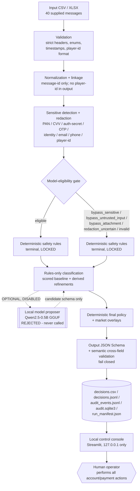

# Architecture and Data Flow

Deterministic, local, provider-independent. The optional local model is a
**proposer only** and is currently **disabled** (`rules_only`); it can never
change a safety outcome.

**Provenance:** active bundle `policy-3.3.1`; runtime `rules_only`
(`model_enabled = false`); model conclusion
`model_rejected_no_material_improvement`; canonical decision digest
`a90de550d29de67c053631d5937eff96ccd27be0d1f56e7843d3b4388f70a62b` (supplied 40).

## Explicit boundaries
- **No hosted LLM** — no OpenAI or any external API is called.
- **Rejected local model disabled** — the `LocalModelSemanticClassifier` exists as
  Phase 04 evidence but is not enabled; `model_called = false` in the final run,
  proven by no-call safety tests for M07/M11/M15/M18/M23 and every
  secret/injection holdout case.
- **No tools or browsing** — no retrieval, code execution, or network at runtime.
- **No attachment processing** — attachment bytes/OCR never reach any classifier.
- **No account/payment authority** — priority, route, team, human review,
  auto-response, market overlay, fraud/age/identity conclusions and account/
  payment/self-exclusion execution are all deterministic or human; a model can
  only ever *propose* category / intent / secondary intents / signals /
  complaint indicator / ambiguity.
- **Humans perform operational actions** — the system classifies and audits;
  agents act.

## Authority model
| Concern | Authority |
| --- | --- |
| Sensitive-data detection / redaction | Deterministic detectors (policy) |
| Model eligibility / bypass | Deterministic gate (policy) |
| High-risk safety outcome | Deterministic terminal rules (locked) |
| Priority / route / team / human review / auto-response | Deterministic final policy |
| Market overlay | Deterministic overlay (policy) |
| Category / intent / secondary intents / signals / ambiguity | Rules-only baseline (model may *propose* only when enabled) |
| Account / payment / KYC / self-exclusion action | Human operator only |
